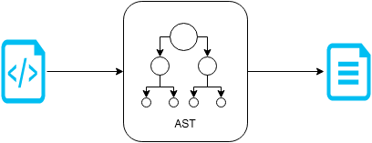

# Jtwig Core

<p style="text-align: justify;">
Within this section one will detail how to work with Jtwig at it's core API. As a template engine, Jtwig has three main concepts, they are <b>Environment</b>, <b>Resource</b> and <b>Model</b>.
</p>

```
Output = (Environment, Resource, Model)
```

<p style="text-align: justify;">
The <b>Environment</b> contains all Jtwig configurations and predefined behaviour, this includes possible extensions that might be added. The <b>Resource</b> contains the intermediate Jtwig representation, also known as Template and the <b>Model</b> is the container of key and value pairs which combined with the Template generates the output. We can break it down in the following way.
</p>

```
Template = (Environment, Resource)
```

<p style="text-align: justify;">
Where, basically, the <code>Template</code> is the combination of the <b>Environment</b> with the <b>Resource</b>. This has special meaning when extensions are added and means some intermediate representations don't mean anything without the proper extension added to the <b>Environment</b>. Note that, one will detail about Extensions later on.
</p>

```
Output = (Template, Model)
```

### Hello World Example

<p style="text-align: justify;">
Let's now have a look at the famous Hello World program in Jtwig using the core API.
</p>


```java
// Environment
EnvironmentConfiguration configuration = new DefaultEnvironmentConfiguration();
EnvironmentFactory environmentFactory = new EnvironmentFactory();
Environment environment = environmentFactory.create(configuration);

// Resource
Resource resource = new StringResource("Hello {{ token }}!");

// Template
JtwigTemplate jtwigTemplate = new JtwigTemplate(environment, resource);

// Model
JtwigModel model = new JtwigModel().with("token", "World");

// Output
String output = jtwigTemplate.render(model);
```

<p style="text-align: justify;">
As one can see, the way Jtwig core API is built follows the same concepts mentioned before, where the <b>Enviornment</b> and <b>Resource</b> are first instantiated in order to create the <code>JtwigTemplate</code>, which when combined with the <code>JtwigModel</code> generates the output.
</p>

**Jtwig Model**

<p style="text-align: justify;">
Jtwig Model can be seen as a map of properties, which will then be used to render the template. The keys can only be valid Java identifiers as mentioned before.
</p>

```java
JtwigModel model = new JtwigModel()
     .with("variable", "Jtwig")
     .with("secondVariable", 1);
```

### Rendering Pipeline

<p style="text-align: justify;">
Jtwig rendering pipeline starts with parsing the resource into Jtwig AST (Abstract Syntax Tree).
</p>

<p style="text-align: center;">

</p>

<p style="text-align: justify;">
This AST is then combined with the model to generate the final output. At this stage the content is escaped based on what was defined by the template (using <code>autoescape</code> tag, <code>espace</code> or <code>raw</code> functions).
</p>